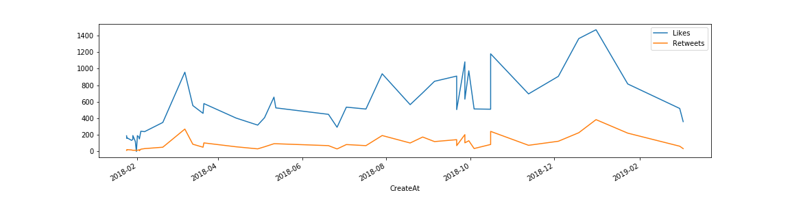

# JLO
Analyzing President João Lorenço's twitter data with tweepy, pandas, numpy and matplot. 



## Getting Started
To run the project all you have to do is:

```sh
git clone https://github.com/doriel/JLO.git
cd JLO
jupyter notebook
```
Then on the browser go to ***http://localhost:8888*** and make the changes you wish.

## Contributing
Feel free to make a ***PR***

## License

This project is licensed under the GNU GENERAL PUBLIC LICENSE - see the [LICENSE.md](LICENSE) file for details

## Acknowledgments
Special thanks goes to:
* [Deniz Jafari](https://github.com/denizjafari/Sentiment-Analysis)
* [Rodolfo Ferro](https://github.com/RodolfoFerro/pandas_twitter)
